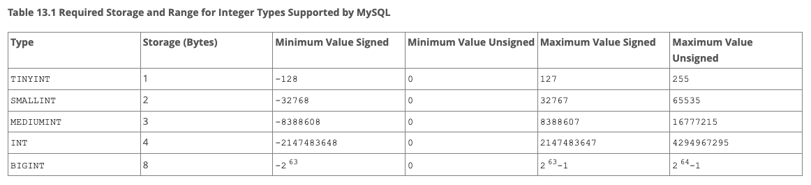
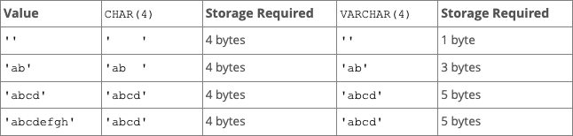

# [MySQL](https://www.mysql.com/)

- Relational Database

## Things to Note

- Order of operation & functions matter in a query as queries are executed in left to right manner

## [SQL Mode](https://mariadb.com/kb/en/sql-mode/)

- different versions of sql can have different modes enabled that might break some of the queries if different versions

```sql
mysql>    SET @@sql_mode='';
```

## Getting Started

- To start MySQL Server, you need to start the server from GUI or from CLI

1.  Navigate to the desired folder where sql files will be stored

2.  Login to the started server

    ```sh
    $    mysql -u root -p

        # -u ==> username & -p is prompt for password
    ```

3.  Run the query from a particular file by
    ```sql
    mysql>     source file_name.sql
    ```

## Advantage over SpreadSheets

- Spreadsheets works almost similar to a DB, but it comes with certain limitations
  - **Datatype Limitation** - any data can be stored in any row or column (string/column anything) which can result in a mess
  - retrieving and inserting data is comparitively difficult that normal DB

## [DATATYPES](https://dev.mysql.com/doc/refman/8.0/en/data-types.html)

### Numeric Datatypes

- Integer Types

  - `INT` | `SMALLINT` | `TINYINT` | `MEDIUMINT` | `BIGINT`

  

- Decimals
  - `DECIMAL(total_digits, fixed_no_of_decimal_digits)`
- Floating Point Types
  - `FLOAT` | `DOUBLE`
- Bit Value Types
  - `BIT`

### String Datatypes

- `CHAR` | `VARCHAR` - Characters & Variable Characters

  

- `BINARY` | `VARBINARY` - Binary & Variable Binary
  - used for storing image data
- `BLOB` | `TEXT` - Blob & Text Types
  - blob used for storing large image data
- `ENUM` - Enum Types
  - used for storing option data
- `SET` -

### Date and Time Data Types

```sql
-- example

CREATE TABLE
    users (
        name VARCHAR(50),
        col1 DATE,
        col2 TIME,
        col3 DATETIME
    );


INSERT INTO
    users (name, col1, col2, col3)
VALUES
    ("sohan", "2024-06-09", "10:14:22", "2025-06-09 11:12:13"),
    ("vaigankar", "2024-06-10", "11:15:23", NOW());

-- retrieving values of day, month & year
SELECT
    DAY (col3) as Day,
    MONTH (col3) as Month,
    YEAR (col3) as Year
FROM
    users;
```

### Spatial Data Types

- mostly used to store geo-location data

### JSON Data Types

- used for backend APIs

### Default Values Data Types

- `DEFAULT value`

```sql
CREATE TABLE t1 (
  -- literal defaults
  i INT         DEFAULT 0,
  c VARCHAR(10) DEFAULT '',
  -- expression defaults
  f FLOAT       DEFAULT (RAND() * RAND()),
  b BINARY(16)  DEFAULT (UUID_TO_BIN(UUID())),
  d DATE        DEFAULT (CURRENT_DATE + INTERVAL 1 YEAR),
  p POINT       DEFAULT (Point(0,0)),
  j JSON        DEFAULT (JSON_ARRAY())
);
```

## BASICS

#### 1. `SHOW DATABASES;`

- shows the list of available DBs

### Creating and Selecting a Database

#### 2. `CREATE DATABASE DB_NAME;`

- creates a DB with name 'DB_NAME'

  ```sql
    CREATE DATABASE photo_studio;
  ```

#### 3. `DROP DATABASE DB_NAME;`

- deletes specified DB

  ```sql
    DROP DATABASE photo_studio;
  ```

#### 4. `USE DB_NAME;`

- selectes specified DB

  ```sql
    USE photo_studio;
  ```

#### 5. `SELECT DATABASE();`

- shows the currently selected DB
- displays NULL if no DB is selected

  ```sql
    SELECT DATABASE();
  ```

### Creating & Deleting Table(s)

#### Use [this reference table](#canon-cameras) for canon cameras

#### 6. `CREATE TABLE TABLE_NAME( column1 DATAYPE, column2 DATATYPE );`

- creates a specified table in the selected DB with desired columns
- as per convention, table names are kept plural
- DATATYPE of the column bust be written against their definition

  ```sql
    CREATE TABLE cameras (
        model_name VARCHAR(30),
        quantity INT
    );
  ```

#### 7. `DESC TABLE_NAME;`

- displays the structure of the table

  ```sql
    DESC cameras;
  ```

#### 8. `DROP TABLE TABLE_NAME;`

- deletes the table from the DB

  ```sql
    DROP TABLE cameras;
  ```

#### 9. `SHOW TABLES;`

- displays all the table currently present in the DB

  ```sql
    SHOW TABLES;
  ```

### Inserting data into Table(s)

#### 10. `INSERT INTO TABLE_NAME(column1, column3) VALUES(column1_data, column3_data);`

- inserts data into the specified table
- values to be inserted should be order-sensitive w.r.t columns specified
- n number of values can be inserted

  ```sql
    INSERT INTO CANON_CAMERAS(model_name, quantity) VALUES("70-D", 300), ("80-D", 400), ("EOS-R", 500), ("50-D", 100);
  ```

### CRUD Operations

#### 11. `SELECT COLUMN_NAME(S) FROM TABLE_NAME;`

- retrieves data from the specific column of the table
- `SELECT *` retrives all the columns, hence a costly operation

  - Retriving all the columns from canon_cameras table

    ```sql
    SELECT * FROM canon_cameras;
    ```

  - Retriving data of 1 column from canon_cameras table

    ```sql
    SELECT model_name FROM canon_cameras;
    ```

  - Retriving data of 2 column from canon_cameras table

    ```sql
    SELECT model_name, quantity FROM canon_cameras;
    ```

  - `WHERE CONDITON` - Where Clause

    - Retrieves data only if it satisfies WHERE clause

    - Retriving quantity data if column satisfies WHERE condition

      - by default strings in WHERE condition are not case sensitive

      ```sql
      <!-- Fetches quantity of 80-d model -->
      SELECT model_name, quantity FROM canon_cameras WHERE model_name="80-d";

      <!-- Fetches models with quantities more than 299 -->
      SELECT model_name, quantity FROM canon_cameras WHERE quantity >= 300;
      ```

### Primary Key, Default Values and Not Null

#### Use [this reference table](#avengers) for customer

- `PRIMARY KEY`
  - unique identifier for each row in the table
  - Primary Key shouldn't be NULL
  - if primary key is an INT then it is better to AUTO_INCREMENT it (not mandatory)
- `NOT NULL`
  - marks the field as not null, so it cannot be left empty
- `DEFAULT`

  - fills the field with default data if the field is empty

    ```sql
    CREATE TABLE
    customers (
        id INT NOT NULL AUTO_INCREMENT,
        first_name VARCHAR(30) NOT NULL,
        last_name VARCHAR(30),
        character_name VARCHAR(30) NOT NULL,
        email VARCHAR(40) NOT NULL DEFAULT "NA",
        universe VARCHAR(20) NOT NULL,
        amount INT,

        PRIMARY KEY (id)
    );
    ```

- `AS` or ALIAS

  - changing the name of returning column to the desired name

  ```sql
  SELECT COLUMN_NAME AS DESIRED_NAME FROM TABLE_NAME;

  <!-- Example -->
  SELECT first_name AS "Customer Name" FROM customers;
  ```

#### 12. `UPDATE`

- updates entry of the specified table with the desired SET data if the WHERE clause is satisfied
- UPDATE query is executed on all the entries that satisfies WHERE clause

  - Syntax w/ example

    ```sql
    <!-- syntax -->
    UPDATE table_name SET column_data_to_be_updated=value WHERE condition;

    <!-- example -->
    UPDATE customers SET amount=690 WHERE character_name="flash";
    ```

#### 13. `DELETE`

- deletes entries from table if the WHERE clause is satisfied

  - Syntax w/ example

    ```sql
    <!-- syntax -->
    DELETE FROM table_name WHERE condition;

    <!-- example -->
    DELETE FROM customers WHERE character_name="shaktiman";
    ```

### String Functions and Operators

- More functions can be found [here](https://dev.mysql.com/doc/refman/8.4/en/string-functions.html)

#### 14. `CONCAT`

- fn that concatanates whatever params that are passes to it
- by default it gives default heading as entire concat fn hence ALIAS is to be used
- used w/ SELECT
- Doesn't modify the original table

  - Syntax w/ example

    ```sql
    <!-- syntax -->
    SELECT CONCAT(param1, param2) FROM table_name;

    <!-- example -->
    SELECT CONCAT(first_name, ' ',  last_name) AS "Customer Name" FROM customers;

    SELECT
        CONCAT (first_name, ' ', last_name) AS "Customer Name",
        email
    FROM
        customers;
    ```

#### 14. `REPLACE(main_str, str_to_be_replaced, replace_with_str)`

- fn that replaces a specified part of main string with replacement string
- case sensitive
- used w/ SELECT
- Doesn't modify the original table

  - Syntax w/ example

    ```sql
    <!-- syntax -->
    SELECT REPLACE(main_str, str_to_be_replaced, replace_with_str) FROM table_name;

    <!-- example -->
    SELECT REPLACE(first_name, 'a', '@') AS "Result" FROM customers;
    ```

#### 15. `SUBSTRING(main_str, start_index, character_count)`

- fn that gives a substring of the main string starting from specified index till the specified character count
- here, index starts from **1**
- if character count is not specified, it gives the whole string
- used w/ SELECT
- Doesn't modify the original table

  - Syntax w/ example

    ```sql
    <!-- syntax -->
    SELECT SUBSTRING(main_str, start_index, character_count) FROM table_name;

    <!-- example -->
    SELECT SUBSTRING(first_name, 'a', '@') AS "Substring Result" FROM customers;
    ```

#### 16. `REVERSE(str)`

- fn to reverse the string
- used w/ SELECT

  - Syntax w/ example

    ```sql
    <!-- syntax -->
    SELECT REVERSE(str) FROM table_name;

    <!-- example -->
    SELECT REVERSE(first_name) AS "Result after reversing" FROM customers;
    ```

#### 17. `CHAR_LENGTH(str)`

- fn to find length of the string
- used w/ SELECT

  - Syntax w/ example

    ```sql
    <!-- syntax -->
    SELECT CHAR_LENGTH(str) FROM table_name;

    <!-- example -->
    SELECT CHAR_LENGTH(first_name) AS "Character length of Names" FROM customers;
    ```

#### 18. Case Conversion - `UPPER(str)` AND `LOWER(str)`

- fns to covert string into uppercase and lowercase
- used w/ SELECT

  - Syntax w/ example

    ```sql
    <!-- syntax -->
    SELECT UPPER(str) FROM table_name;
    SELECT LOWER(str) FROM table_name;

    <!-- example -->
    SELECT UPPER(first_name) AS "Fist Name (UpperCase)" FROM customers;
    SELECT LOWER(last_name) AS "Last Name (LowerCase)" FROM customers;
    ```

#### 19. `ALTER TABLE table_name operation `
- ALTER TABLE query is used to make changes in tha table schema, say adding or deleting a column from table
- Syntax w/ example

    ```sql
    <!-- syntax & examples -->
    ALTER TABLE users DROP name;

    ALTER TABLE users ADD first_name VARCHAR(30) NOT NULL;
    ```

## INTERMEDIATE

#### 1. `DISTINCT`

- gives distinct result by filtering out duplicate entries w.r.t column/condition
- used w/ SELECT
- not case sensitive

  - Syntax w/ example

    ```sql
    <!-- syntax -->
    SELECT DISTINCT column_name FROM table_name;

    <!-- example - can be used to find the number of users -->
    SELECT DISTINCT email  FROM customers;
    ```

#### 2. `ORDER BY`

- sorts entries in ASC/DESC order w.r.t column/condition
- used w/ SELECT
- by default order is `ASC` - Ascending
- Syntax w/ example

  ```sql
  <!-- syntax -->
  SELECT column_name FROM table_name ORDER BY column_name DESC;

  <!-- example -->
  SELECT  email  FROM customers ORDER BY amount DESC;
  ```

#### 3. `LIMIT start_index, limit_count`

- gives a limited number of entries based on `limit_count` from the `start_index`
- start_index starts from 0
- start_index is options, if not specified, start_index is set to 0 by default
- used w/ SELECT
- Syntax w/ example

  ```sql
  <!-- syntax -->
  SELECT DISTINCT column_name FROM table_name ORDER BY column_name DESC LIMIT start_index, limit_count;

  <!-- examples -->

  <!-- w/ start_index -->
  SELECT DISTINCT email  FROM customers ORDER BY amount DESC LIMIT 2, 5;

  <!-- w/o start_index -->
  SELECT DISTINCT email  FROM customers ORDER BY amount DESC LIMIT  5;
  ```

### [Pattern Matching using RegEx](https://dev.mysql.com/doc/refman/8.0/en/regexp.html)

#### 4. `LIKE 'prefix%'` `LIKE '%suffix'`

- gives entries that matches the specified RegEx where % is rest of the part of the string before and after a suffix and a prefix resp.
- `_` - underscrore can be used too to specify the presence of unknown character (like to search a string having 4 charcters)
- used w/ SELECT & WHERE CLAUSE
- Syntax w/ example

  ```sql
  <!-- syntax -->
  SELECT column_name FROM table_name WHERE column_name LIKE 'prefix%';

  <!-- examples -->

  SELECT email  FROM customers WHERE email LIKE '%@gotg.com';

  SELECT email  FROM customers WHERE email LIKE '%@gotg%';

  SELECT email  FROM customers WHERE email LIKE '%@go_g%';
  ```

#### 4. `COUNT(column_name)`

- gives the total count of the entries.
- used w/ SELECT & WHERE CLAUSE
- Syntax w/ example

  ```sql
  <!-- syntax -->
  SELECT COUNT(column_name) FROM table_name;

  <!-- examples -->

  <!-- gives the count of distinct entries w.r.t first_name & last_name -->

  SELECT DISTINCT COUNT(CONCAT(first_name, last_name)) as "Customer Count" FROM customers;
  ```

#### 5. `GROUP BY column_name`

- groups the entries w.r.t column_name/condition
  - stacks the entries that belong to one group together
- mostly never used alone, used with COUNT, MAX or some other fn
  - COUNT is used to know how many entries belong to a particular group
- Syntax w/ example

  ```sql
  <!-- syntax -->
  SELECT column_name, COUNT(*) FROM table_name GROUP BY column_name;

  <!-- examples -->

  <!-- groups customers by their universe -->
  SELECT universe, COUNT(*) as "Customer Count" FROM customers GROUP BY universe;
  ```

### SubQueries

- subqueries can be costly if DB pricing is based on number of queries as n Query with m subqueries will be n+m queries

#### 6. `MIN(column_name)` and `MAX(column_name)`

- gives min/max from the column/condition
- Syntax w/ example

  ```sql
  <!-- syntax -->
  SELECT column_name FROM table_name WHERE condition = (SELECT MIN(column_name) FROM table_name);

  <!-- examples -->

  <!-- subquery for min -->
  SELECT first_name, last_name FROM customers WHERE amount = (SELECT MAX(amount) FROM customers);

  <!-- subquery for max -->
  SELECT first_name, last_name FROM customers WHERE amount = (SELECT MIN(amount) FROM customers);

  <!-- GROUP BY w/ max subquery -->
  SELECT CONCAT(first_name, ' ' , last_name) FROM customers WHERE amount = (SELECT MIN(amount) FROM customers);

  <!-- GROUP BY w/ MAX & MIN - min-max amount spent by customers from each universe -->
    SELECT
        universe,
        MIN(amount) AS "Minimum Spend",
        MAX(amount) AS "Maximum Spend"
    FROM
        customers
    GROUP BY
        universe;
  ```

#### 7. `SUM(column_name)` and `AVG(column_name)`

- gives sum & average of resulting column
- Syntax w/ example

  ```sql
  <!-- syntax -->
  SELECT SUM(column_name) FROM table_name;

  SELECT AVG(column_name) FROM table_name;

  <!-- examples -->

  <!-- GROUP BY w/ SUM & AVG - sum & average amount spent by customers from each universe -->
    SELECT
        universe,
        SUM(amount) AS "Total Amount Spent",
        AVG(amount) AS "Average Amount/Customer"
    FROM
        customers
    GROUP BY
        universe;
  ```

#### 8. `AND` and `OR`

- used for adding AND & OR logic to the conditions
- Syntax w/ example

  ```sql
  <!-- syntax -->
  SELECT column_name FROM table_name WHERE condition1 AND condition2;

  SELECT column_name FROM table_name WHERE condition1 OR condition2;

  <!-- examples -->

  <!-- AND -->
    SELECT
        first_name,
        amount
    FROM
        customers
    WHERE
        universe = "marvel"
        AND amount <= 500;

  <!-- OR -->
    SELECT
        first_name,
        amount,
        universe
    FROM
        customers
    WHERE
        universe = "dc"
        OR amount <= 500;
  ```

#### 9. `BETWEEN from_value AND to_value` - Range

- used for getting entries that are in a particular range
- used with AND operator
- Syntax w/ example

  ```sql
  <!-- syntax -->
  SELECT column_name FROM table_name WHERE column_name BETWEEN from_value AND to_value;

  <!-- examples -->

    SELECT
        first_name,
        amount
    FROM
        customers
    WHERE
        amount BETWEEN 300 AND 1000;
  ```

#### 10.`CASE`, `WHEN`, `THEN` - Switch Case

- used for seggregating data into particular ranges
- Syntax w/ example

  ```sql
  <!-- syntax -->
    SELECT
        column_name,
        CASE
            WHEN condition1 THEN 'action 1'
            WHEN condition2 THEN 'action 2'
            ELSE 'else action' AS "Result"
    FROM
        table_name;

  <!-- examples -->

    SELECT
        first_name,
        amount,
        CASE
            WHEN amount
                BETWEEN 0 AND 500 THEN 'FREE TIER'
            WHEN amount
                BETWEEN 501 AND 1000 THEN 'GOLD TIER'
            ELSE 'PLATINUM TIER'
        END AS "Customer Tier"
    FROM
        customers;


        <!-- example 2 -->

    SELECT
        first_name,
        amount,
        CASE
            WHEN amount > 10000 THEN 'PLATINUM TIER'
            WHEN amount > 500 THEN 'GOLD TIER'
            ELSE 'FREE TIER'
        END AS "Customer Tier"
    FROM
        customers;
  ```

## ADVANCE

### Dealing with multiple tables

- Need of having multiple tables
  - For simplification, to avoid data clutter
  - Easier to perform operations

#### Types of Relations

- These are the connections that can be made b/w tables
  1. One-To-One
     - one row of a table can only have one entry in another table
     - use cases:
       - link b/w auth & users table
  2. One-To-Many
     - one row of a table can have multiple entries in another table
     - use cases:
       - link b/w users & orders table
  3. Many-To-Many
     - many rows of a table can have multiple entries in another table
     - use cases:
       - link b/w courses & users table
  4. Many-To-One
     - many rows of a table can have one entry in another table
     - use cases:
       - link b/w products & categories table

#### FOREIGN KEY

- Foreign key is actually a Primary Key of another table, say B that acts as a connection to table A
- it basically joins two or more tables to each other

- Advantage

  - If a foreign key doesn't exist, data cannot be inserted w.r.t that particular foreign key in that table

  ```sql
  <!-- example -->
  CREATE TABLE
  users (
      id INT AUTO_INCREMENT PRIMARY KEY,
      name VARCHAR(30) NOT NULL,
      email VARCHAR(50),
      updated_at DATETIME NOT NULL,
      created_at DATETIME NOT NULL DEFAULT CURRENT_TIMESTAMP
  );

  DESC users;

  CREATE TABLE
      orders (
          id INT AUTO_INCREMENT PRIMARY KEY,
          order_description VARCHAR(100),
          amount INT NOT NULL,
          cart_items JSON,
          user_id INT NOT NULL,
          updated_at DATETIME NOT NULL,
          created_at DATETIME NOT NULL DEFAULT CURRENT_TIMESTAMP,
          FOREIGN KEY (user_id) REFERENCES users (id)
      );

  DESC orders;

  ALTER TABLE users DROP name;
  ALTER TABLE users ADD first_name VARCHAR(30) NOT NULL;
  ALTER TABLE users ADD last_name VARCHAR(30);
  ALTER TABLE users ADD mobile VARCHAR(10);

  DESC users;

  INSERT INTO
      users (first_name, last_name, mobile, email, updated_at)
  VALUES
      ("Tony", "Stark", "9999999999", "tony@starkindustries.com", NOW()),
      ("Peter", "Parker", "8888888888", "peter@starkindustries.com", NOW()),
      ("Natasha", "Romanoff", "7777777777", "natasha@sheild.com", NOW()),
      ("Bruce", "Banner", "9898989898", "bruce@starkindustries.com", NOW());


  SELECT * FROM users;


  INSERT INTO
      orders (
          cart_items,
          amount,
          order_description,
          user_id,
          updated_at
      )
  VALUES
      ( '{"item_name": "Mackbook Air 13 2020", "price": 1000, "discount": 20}', 800, "Coupon: SALE20", 3, NOW()),
      ( '{"item_name": "Mackbook Pro 16 2020", "price": 1500, "discount": 30}', 1050, "Coupon: SALE30", 1, NOW());

  <!-- Following insert will throw an error as we're trying to insert an entry with foreign key '10' whose user doesn't exist in user table  -->

  INSERT INTO
      orders (
          cart_items,
          amount,
          order_description,
          user_id,
          updated_at
      )
  VALUES
      ( '{"item_name": "Mackbook Pro 16 2020", "price": 1500, "discount": 30}', 1050, "Coupon: SALE30", 10, NOW());

  ```

### JOINS

- this is a way to merge 2 tables
  

#### 1. `INNER JOIN`

- A Inner Join is when after joining Table 1 & 2, we consume a bit of info from both table 1 & 2
- Only entries that satisfy join condition are returned.
- Inner Join is the default join if Join Type is not specified
- Inner Join expects both Table 1 & 2 to have necessary data

  - if join condition is not met, that particular entry is skipped

- Syntax w/ example

  ```sql
  SELECT
      Table1.col1,
      Table2.col2,
      Table1.col5
  FROM
      Table1
      INNER JOIN Table2 ON Table1.col6 = Table2.col1;

      -- here Table1.col6 ==> Foreign Key of Table 1 &  Table2.col1 ==> Primary Key of Table 2
      -- ON ==> is used to specify the basis of the join


  <!-- Example 1: Joining 2 Tables -->

  <!-- Display all OrderID, Customer Name And Order Date -->

  SELECT
      Orders.OrderID,
      Customers.CustomerName,
      Orders.OrderDate
  FROM
      Orders
      INNER JOIN Customers ON Orders.CustomerID = Customers.CustomerID;

  <!-- Example 2: Joining 3 Tables -->

  <!-- Display all OrderID, Customer Name And Shipper Name -->

  SELECT
      Orders.OrderID,
      Customers.CustomerName,
      Shippers.ShipperName
  FROM
      (
          (
              Orders
              INNER JOIN Customers ON Orders.CustomerID = Customers.CustomerID
          )
          INNER JOIN Shippers ON Orders.ShipperID = Shippers.ShipperID
      );
  ```

#### 2. `LEFT JOIN`

- A Left Join is when after joining table 1 & 2, we consume all the info from table 1
- Right table is allowed to return null
- Left Join expects Table 1 to have the necessary data but Table 2 may or may not have it

  - if join condition is not met, that particular entry is shown as NULL

  - Syntax w/ example

    ```sql
    SELECT
        Table1.col1,
        Table2.col2,
    FROM
        Table1
        LEFT JOIN Table2 ON Table1.col6 = Table2.col1;

      -- here Table1.col6 ==> Foreign Key of Table 1 &  Table2.col1 ==> Primary Key of Table 2
      -- ON ==> condition to form the join
      -- Table 1 is Left Table & Table 2 is Right Table

    <!-- Example -->

      -- Display all Customer Name And OrderID

    SELECT
        Customers.CustomerName,
        Orders.OrderID
    FROM
        (
            Customers
            LEFT JOIN Orders ON Customers.CustomerID = Orders.CustomerID
        );
    ```

#### 3. `RIGHT JOIN`

- A Right Join is when after joining table 1 & 2, we consume all the info from table 2
- Left table is allowed to return null
- sometimes right join isn't availabe on onile DB instances

  - mostly because it doesn't make sense sometimes
    - example: customer can have no orders, but orders should always have a customer
  - if still Right join is neede, tables can be swapped with a Left join

  - Syntax w/ example

    ```sql
    SELECT
        Table1.col1,
        Table2.col2,
    FROM
        Table1
        RIGHT JOIN Table2 ON Table1.col6 = Table2.col1;

        -- table 1 ==> right, table 2 ==> left
    ```

#### 4. `FULL OUTER JOIN`

- A Full Outer Join is when after joining table 1 & 2, we consume all the info from both table 1 & 2
- All the entries are returned regardless of whether they satisy join condition or not.
- in MySQL, Full Outer join is not allowed, it will throw error

#### `UNION`

- Union joins the specified columns of table 1 & 2 and gives a result

- Syntax w/ example

  ```sql
  SELECT
      Table1.col1,
  FROM
      Table1 UNION ALL
  SELECT
      Table2.col1,
  FROM
      Table2;


      <!-- example: combining list of cities from two tables -->
    SELECT
        Customers.City
    FROM
        Customers
    UNION ALL
    SELECT
        Suppliers.City
    FROM
        Suppliers;

        -- ALL combines every entry, if want DISTINCT, remove ALL will reomve duplicates
  ```

## [Database Engines / Storage Engines](https://dev.mysql.com/doc/refman/8.0/en/storage-engines.html)

- DB queries are stored in a sql file that is executed by DB Engine
- Engine provides with constraints and supports for different features and stuff
- Features
  - Point Time Recovery
  - Encryption, index caches, T-tree index
- Types of Engines
  1. InnoDB
  2. MyISAM

## ACID Properties

- following are some principles that a good DB should follow

### A - Atomicity

- Atomicity says every single transaction should be atomic in nature
- Simply means, whatever query is being executed should be either successful or fail.
- example: bank transaction of $500 should take place from A --> B only if A and B are verified. otherwise transaction shall fail

### C - Consistency

- Database should be consistent with errors and other stuff

### I - Isolation

- Transactions that are happening should be isolated from each other
- example: bank transactions from A --> B shouldn't reach to C

### D - Durability

- Db should be durable, in case of failure recovery mechanisms shoub be set up

---

### Reference Tables

#### Canon Cameras

```sql
CREATE TABLE
    canon_cameras (model_name VARCHAR(30), quantity INT);

INSERT INTO
    CANON_CAMERAS (model_name, quantity)
VALUES
    ("70-D", 300),
    ("80-D", 400),
    ("EOS-R", 500),
    ("50-D", 100);
```

#### Avengers

```sql
CREATE TABLE
customers (
    id INT NOT NULL AUTO_INCREMENT,
    first_name VARCHAR(30) NOT NULL,
    last_name VARCHAR(30),
    character_name VARCHAR(30) NOT NULL,
    email VARCHAR(40) NOT NULL DEFAULT "NA",
    universe VARCHAR(20) NOT NULL,
    amount INT,
    PRIMARY KEY (id)
);

INSERT INTO
    customers (first_name, last_name, character_name, email, amount, universe)
VALUES
    ("Tony", "Stark", "Iron man", "ironman@avengers.com", 10000, "marvel"),
    ("Clint", "Barton", "Hawkeye", "hawkeye@avengers.com", 500, "marvel"),
    ("Natasha", "Romanoff", "Black Widow", "blackwidow@avengers.com", 100, "marvel"),
    ("Thor", "Odinson", "Thor", "thor@avengers.com", 5000, "marvel"),
    ("Loki", "Odinson", "Loki", "loki@avengers.com", 12000, "marvel"),
    ("Bruce", "Banner", "Hulk", "hulk@avengers.com", 10, "marvel"),
    ("Scott", "Lang", "Ant Man", "antman@avengers.com", 1700, "marvel"),
    ("Steven", "Strange", "Doctor Strange", "doctorstrange@avengers.com", 140, "marvel"),
    ("Peter", "Parker", "Spider-man", "spiderman@avengers.com", 1080, "marvel"),
    ("Steve", "Rogers", "Captain America", "captainamerica@avengers.com", 4000, "marvel"),
    ("Bucky", "Barnes", "Winter Soldier", "wintersoldier@avengers.com", 14000, "marvel"),
    ("Sam", "Wilson", "Falcon", "falcon@avengers.com", 11000, "marvel"),
    ("T'Challa", NULL, "Black Panther", "blackpanther@avengers.com", 300, "marvel"),
    ("Rocket", "Racoon", "Rocket", "rocket@gotg.com", 1000, "marvel"),
    ("Peter", "Quill", "Star Lord", "starlord@gotg.com", 1000, "marvel"),
    ("Drax", NULL, "Drax", "drax@gotg.com", 1002, "marvel"),
    ("Groot", NULL, "Groot", "groot@gotg.com", 1002, "marvel"),
    ("Bruce", "Wayne", "Batman", "batman@justiceleage.com", 1002, "dc"),
    ("Clark", "Kent", "Superman", "superman@justiceleage.com", 1002, "dc"),
    ("Diana", NULL, "Wonder woman", "wonderwoman@justiceleage.com", 1002, "dc"),
    ("Hal", "Jordan", "Green Lantern", "greenlantern@justiceleage.com", 1002, "dc"),
    ("Oliver", "Queen", "Green Arrow", "greenarrow@justiceleage.com", 1002, "dc"),
    ("Arthur", "Curry", "Aquaman", "aquaman@justiceleage.com", 1002, "dc"),
    ("J'ohn", "J'onzz", "Martian Manhunter", "martianmanhunter@justiceleage.com", 1002, "dc"),
    ("Barry", "Allen", "Flash", "flash@justiceleage.com", 1002, "dc"),
    ("Gangadhar", NULL, "Shaktiman", "shaktiman@gmail.com", 72, "indian");
```
